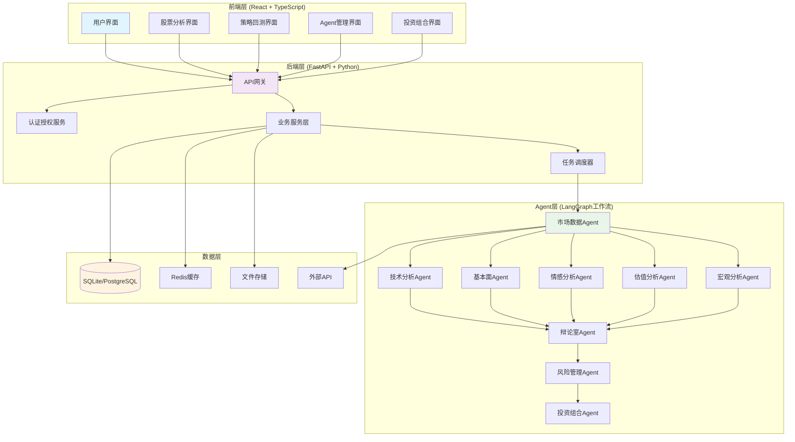
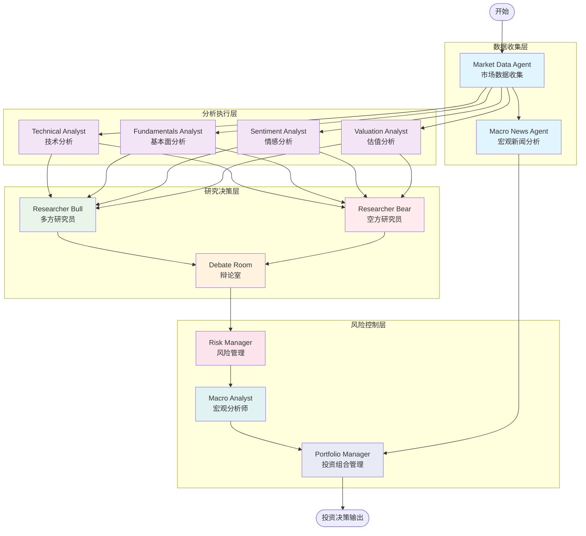
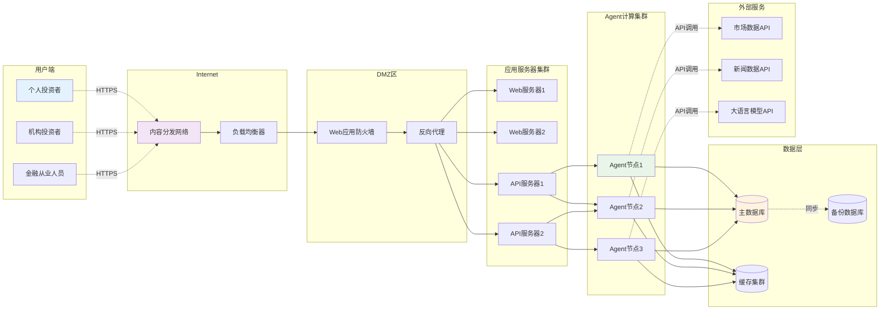
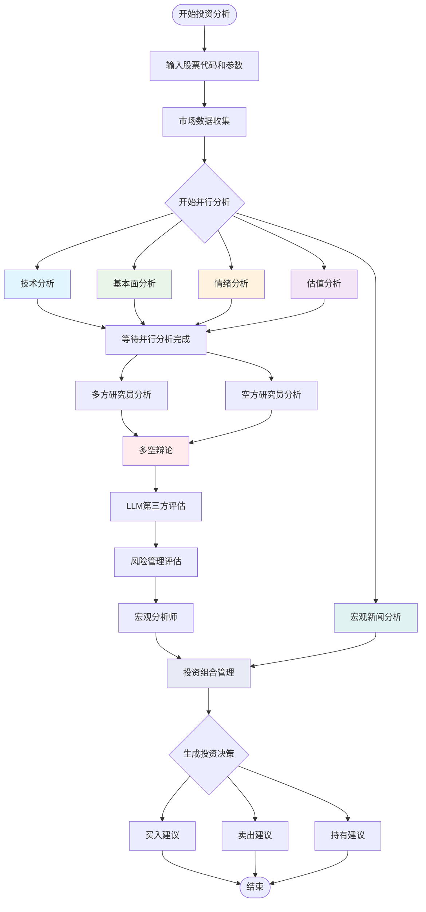
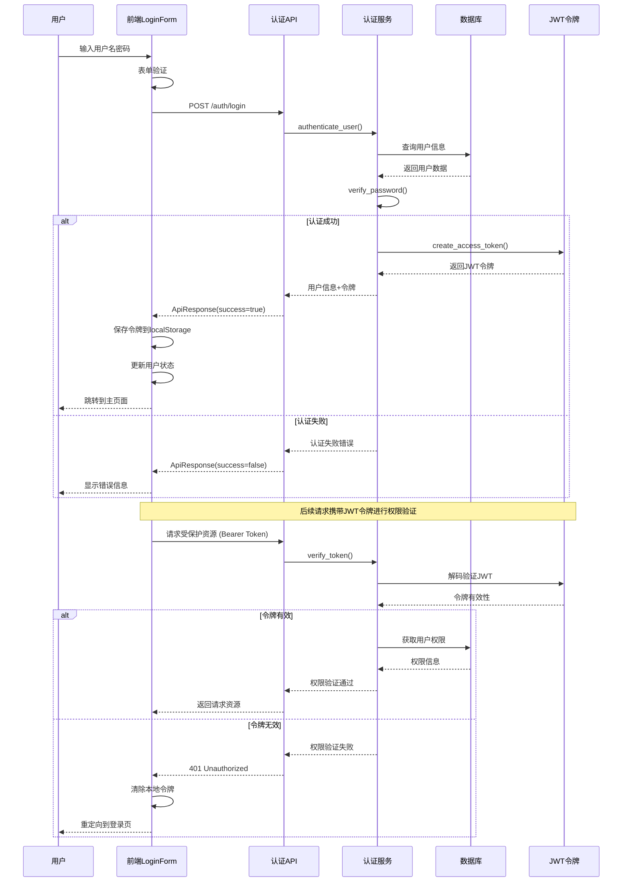
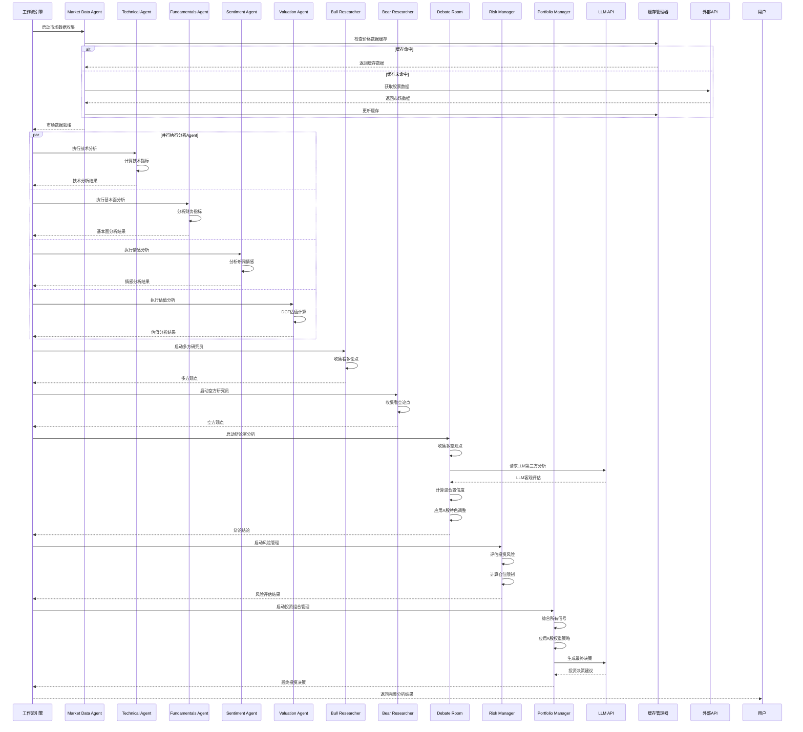
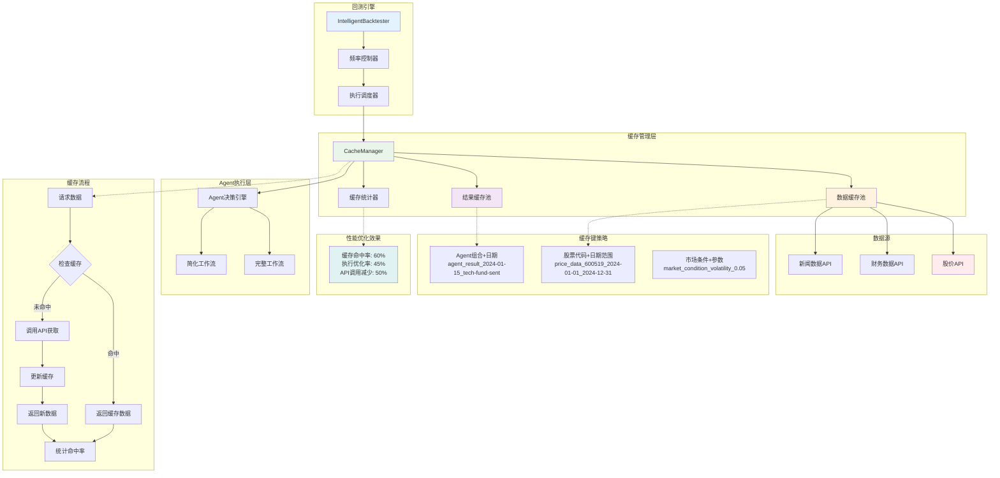
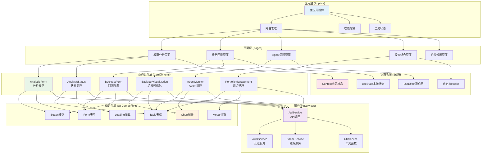

# A股投资Agent系统

[](https://www.python.org/)
[](https://fastapi.tiangolo.com/)
[](https://reactjs.org/)
[](https://www.typescriptlang.org/)
[](https://langchain-ai.github.io/langgraph/)

## 项目概述

A股投资Agent系统是一个基于人工智能的投资决策支持系统，通过多Agent协同工作，结合大型语言模型(LLM)的分析能力，为A股投资提供全方位的分析和决策支持。

### 核心特性

- 🤖 **多Agent协同**: 12个专业Agent独立分析，从多角度评估投资机会
- 🧠 **LLM增强决策**: 集成Gemini/OpenAI等LLM进行深度分析
- 🎯 **辩论室机制**: 多空对决，确保决策的全面性和客观性
- 📊 **智能回测**: 支持细粒度频率控制的回测系统
- 🌐 **前后端分离**: React + FastAPI架构，支持Web界面和API调用
- 🔄 **实时监控**: 完整的日志系统和Agent状态监控

## 系统架构

### 系统整体架构图



### Agent工作流程图



### 系统网络拓扑结构图



### 投资分析活动图



## 技术栈

### 后端技术
- **Python 3.9+** - 核心开发语言
- **FastAPI** - 高性能Web框架
- **LangGraph** - Agent工作流编排
- **SQLite/PostgreSQL** - 数据存储
- **Redis** - 缓存系统
- **Pydantic** - 数据验证和序列化

### 前端技术
- **React 19.1+** - 用户界面框架
- **TypeScript** - 类型安全的JavaScript
- **Ant Design** - UI组件库
- **Vite** - 构建工具
- **Axios** - HTTP客户端

### AI/数据技术
- **LangChain** - LLM应用框架
- **OpenAI API** - 大语言模型
- **Google Gemini** - 谷歌AI模型
- **AkShare** - A股数据获取
- **Pandas/NumPy** - 数据处理
- **Matplotlib** - 数据可视化

## 快速开始

### 环境要求
- Python 3.9+
- Node.js 16+
- Poetry (Python包管理器)

### 安装步骤

1. **克隆项目**
```bash
git clone https://github.com/your-username/AShareAgent.git
cd AShareAgent
```

2. **安装Poetry**
```bash
# Windows PowerShell
(Invoke-WebRequest -Uri https://install.python-poetry.org -UseBasicParsing).Content | py -

# Unix/macOS
curl -sSL https://install.python-poetry.org | python3 -
```

3. **安装后端依赖**
```bash
poetry install
```

4. **安装前端依赖**
```bash
cd frontend
npm install
cd ..
```

5. **配置环境变量**
```bash
# 复制环境变量模板
cp .env.example .env

# 编辑.env文件，填入API密钥
nano .env
```

环境变量配置：
```env
# Gemini API 配置
GEMINI_API_KEY=your-gemini-api-key
GEMINI_MODEL=gemini-1.5-flash

# OpenAI Compatible API 配置（可选）
OPENAI_COMPATIBLE_API_KEY=your-openai-compatible-api-key
OPENAI_COMPATIBLE_BASE_URL=https://your-api-endpoint.com/v1
OPENAI_COMPATIBLE_MODEL=your-model-name
```

### 运行系统

#### 方式1：完整系统（推荐）
```bash
# 启动后端API服务
poetry run python run_with_backend.py

# 在新终端启动前端
cd frontend
npm run dev
```

访问 http://localhost:5173 使用Web界面

#### 用户认证流程



#### 方式2：命令行分析
```bash
# 基本分析
poetry run python src/main.py --ticker 000001

# 显示详细推理过程
poetry run python src/main.py --ticker 000001 --show-reasoning

# 智能回测
poetry run python src/backtesting/backtester.py --ticker 600519 --start-date 2024-01-01 --end-date 2024-12-31
```

## 核心功能

### 1. 多Agent协同分析
- **市场数据Agent**: 收集股票行情、财务数据
- **技术分析Agent**: 计算技术指标，识别趋势
- **基本面Agent**: 分析财务报表，评估基本面
- **情感分析Agent**: 分析新闻情绪，评估市场氛围
- **估值分析Agent**: DCF估值，相对估值分析
- **宏观分析Agent**: 宏观经济环境分析

### 2. 辩论室机制

#### Agent工作流执行时序图



**特性说明**:
- **多方研究员**: 收集看多论据
- **空方研究员**: 收集看空论据  
- **辩论室**: LLM第三方客观评估
- **混合置信度**: 多方信息融合决策

### 3. 智能回测系统

#### 回测系统缓存机制



**特性说明**:
- **频率控制**: 不同Agent可配置不同执行频率
- **缓存优化**: 智能缓存减少API调用
- **性能分析**: 详细的回测报告和可视化
- **风险管理**: 动态止损和仓位管理

### 4. Web界面管理

#### 前端组件架构



**特性说明**:
- **实时监控**: Agent状态和执行进度
- **历史记录**: 分析历史和决策轨迹
- **参数配置**: 灵活的策略参数调整
- **报告导出**: 分析报告和图表导出

## 使用示例

### 单只股票分析
```bash
# 分析贵州茅台
poetry run python src/main.py --ticker 600519 --show-reasoning
```

### 批量回测
```bash
# 贵州茅台2024年回测
poetry run python src/backtesting/backtester.py \
    --ticker 600519 \
    --start-date 2024-01-01 \
    --end-date 2024-12-31 \
    --technical-freq daily \
    --fundamentals-freq weekly \
    --valuation-freq monthly
```

### API调用
```python
import requests

# 启动分析任务
response = requests.post("http://localhost:8000/analysis/start", json={
    "ticker": "600519",
    "initial_capital": 100000,
    "num_of_news": 20
})

# 查看分析结果
result = response.json()
print(result)
```

## 项目结构

```
AShareAgent/
├── backend/                    # 后端API服务
│   ├── main.py                # FastAPI应用
│   ├── routers/               # API路由
│   ├── services/              # 业务逻辑
│   ├── models/                # 数据模型
│   └── utils/                 # 工具函数
├── frontend/                  # 前端React应用
│   ├── src/
│   │   ├── components/        # React组件
│   │   ├── services/          # API服务
│   │   └── App.tsx           # 主应用组件
│   └── package.json          # 前端依赖
├── src/                       # 核心Agent系统
│   ├── agents/               # Agent实现
│   ├── backtesting/          # 回测系统
│   ├── tools/                # 工具模块
│   ├── utils/                # 通用工具
│   └── main.py               # 命令行入口
├── tests/                    # 测试文件
├── logs/                     # 日志目录
├── data/                     # 数据存储
├── poetry.lock               # 依赖锁定
├── pyproject.toml            # 项目配置
└── README.md                 # 项目文档
```

## 风险提示

⚠️ **重要声明**: 本系统仅用于教育和研究目的，不构成投资建议。投资有风险，入市需谨慎。

- 系统分析结果仅供参考，不保证准确性
- 历史回测结果不代表未来收益
- 请结合自身风险承受能力做出投资决策
- 建议在充分了解市场风险后使用

---

⭐ 如果这个项目对你有帮助，请给我们一个Star！